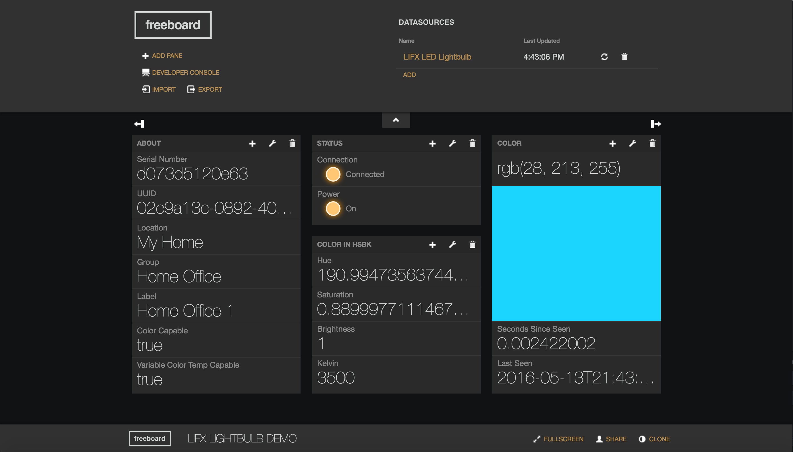
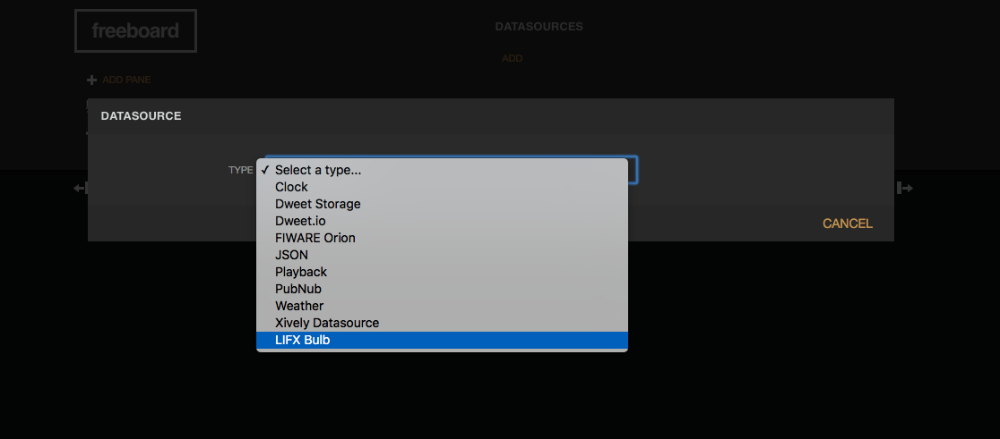
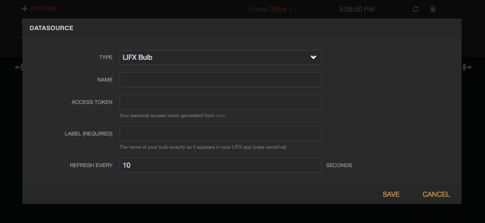

#How to add a LIFX Datasource

Here we will be showing you how to add a LIFX Bulb datasource to your freeboard.

###An example of what your dashboard might look like:

###First, add a Datasource, and choose LIFX Bulb from the dropdown list.

###Next, you will be prompted to fill out a form:

