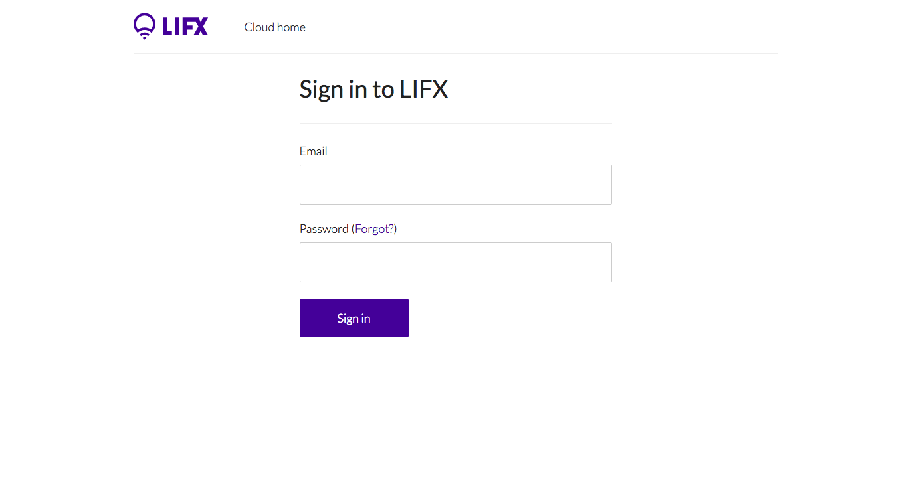
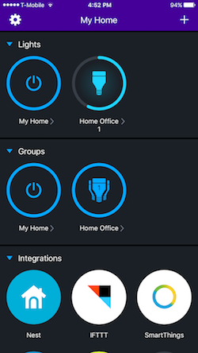

#How to add a LIFX Datasource

Here we will be showing you how to add a LIFX Bulb datasource to your freeboard:

###An example of what your finished dashboard might look like:

###First, add a Datasource, and choose LIFX Bulb from the dropdown list.

###Next, you will be prompted to fill out a form:

Choose any name that will help you identify your bulb.

###Generate an access token by clicking the link "here" in the description.

It will open a new window which will prompt you to sign into your LIFX account that you created when you installed the LIFX app.

###After you sign in, click on the button "Generate New Token"

###Name your token.

###After you name your token, copy and paste it in the appropriate field.

This allows freeboard to access the data from your bulbs.

###Next, put the name of your bulb exactly as it appears in the app into the Label field.

The label is needed for freeboard to know which bulb you want to query. Labels should be unique, otherwise the first bulb matching the label will the datasource. The label of my bulb is "Home Office 1".

###When you're finished, your form should look like this:

##You are now ready to add some widgets!

###First, click on "+ ADD PANE"

You should end up with an empty pane like this:

In this tutorial, we are going to recreate the example dashboard, so my first pane will include information about the bulb.

###Edit the name of your pane

Click on the wrench, fill in the name with Serial Number, and save.

###Add some information from your datasource
Click on the "+"

Select "Text" as your widget type

For the value, first choose the name of your datasource, then choose id. Id in this case is the same as the serial number.
Save.

